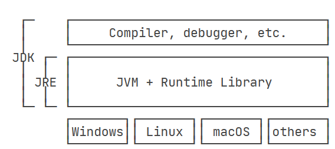

# JAVA快速入门

## Hello World

JDK: Java Development Kit

JRE: Java Runtime Environment



```java
public class Hello {
    // 一个java文件只能定义一个public的类，且类名与文件名完全一致
    public static void main(String[] args) {
        // public 修饰可访问范围
        // static 静态，即不需要定义对象也可以使用的类的方法
        // void 出参为空 不return参数
        // main是固定入口方法，总是从mian开始执行 总是static
        // String[] 变量类型
        // args 变量名
        System.out.println("Hello, world!");
    }
}
```

## JAVA程序基础

###  JAVA基本结构

```java
/**
 * 可以用来自动创建文档的注释
 */
public class Hello {
    public static void main(String[] args) {
        // 向屏幕输出文本:
        System.out.println("Hello, world!");
        /* 多行注释开始
        注释内容
        注释结束 */
    }
} // class定义结束
```

其中``main``方法接受的是一个命令行参数，是一个字符串类型数组。

可以根据不同的参数执行不同的代码，例如``-version``打印程序版本号

###  变量与数据类型

```java
public class Main {
    public static void main(String[] args) {
        int x = 100; // 定义int类型变量x，并赋予初始值100
        System.out.println(x); // 打印该变量的值，观察是否为100
        x = 200; // 重新赋值为200
        System.out.println(x); // 打印该变量的值，观察是否为200
    }
}
```

基本类型：整型、浮点型、字符类型、布尔型

引用类型：字符串（类似于指针，指向一个地址）

常量：``final``定义常量，不可以再次赋值，根据习惯，常量全大写

变量的作用域与花括号有关。

###  整数运算

暂略

###  略

##  流程控制

###  略

##  数组操作

###  暂略

# 面向对象编程

## 面向对象基础

一个类可以包好多个字段``field``，字段用来描述一个类的特征，通过类把一组数据汇集到一个对象上，实现了数据的封装。

创建实例：

```java
Person ming = new Person();
```

代码前半段是定义一种类型的变量，后半段是创建实例。

**一个Java源文件可以包含多个类的定义，但只能定义一个public类，且public类名必须与文件名一致。如果要定义多个public类，必须拆到多个Java源文件中**。

### 方法

直接暴露字段给外部可能会破坏封装性，造成逻辑混乱，可以使用``private``修饰字段，拒绝外部访问。

因此通常``private``字段，并通过``get|set``进行访问。

内部方法可以调用``private``，外部代码无法调用该方法。

在内部，可以使用``this.field``对于当前实例的字段进行访问。

入参也可以写可变类型，相当于数组。

但是可变参数可以保证无法传入``null``，但是数组不可以。另外入参是数组也需要实现构建数组入参。

#### 参数绑定

基本类型会被复制

引用类型传递位置（即指针）所以，所以可以类的内部改变后，外部也会改变。但是``string``是不可变类型，所以每次对``string``对象赋值，都是重新申请一个``string``对象空间，然后把空间赋值给引用。

### 构造方法

构造方法就是类名，``public``类名

构造方法可以调用其他的构造方法，调用方式为``this(...)``

### 继承|extends

```java
class Person {
    private String name;
    private int age;

    public String getName() {...}
    public void setName(String name) {...}
    public int getAge() {...}
    public void setAge(int age) {...}
}

class Student extends Person {
    // 不要重复name和age字段/方法,
    // 只需要定义新增score字段/方法:
    private int score;

    public int getScore() { … }
    public void setScore(int score) { … }
}
```

在OOP的术语中，我们把`Person`称为超类（super class），父类（parent class），基类（base class），把`Student`称为子类（subclass），扩展类（extended class）。

没有被定义的类默认继承了一个``Object``的类，所有的类有且仅有一个父类。

但是继承无法访问``private``的字段及方法，改成``protect``可以被子类访问。

使用``super``关键词来描述父类，如果父类没有默认的构造方法，子类就必须显式调用`super()`并给出参数以便让编译器定位到父类的一个合适的构造方法。子类*不会继承*任何父类的构造方法。子类默认的构造方法是编译器自动生成的，不是继承的。

正常情况下，只要某个class没有`final`修饰符，那么任何类都可以从该class继承。

#### 向上转型

向上转型实际上是把一个子类型安全地变为更加抽象的父类型，别用了，头大。

### 方法重载|Overload

方法名相同，但各自的参数不同，称为方法重载（`Overload`），方法重载的返回值类型通常都是相同的。

### 方法覆写|Override

签名相同的方法才会被Override，可以加上`@Override`让编译器检查覆写的正确性。标记为`final`的方法不能被覆写。

#### 覆写Object方法

### 多态|Polymorphic

暂略，好复杂

### 抽象类

抽象类相当于定义了规范。抽象类在定义类及方法是，必须用`abstract`修饰。可以使用抽象类去引用其子类，方法调用时，就不用担心其具体的子类型。

这种尽量引用高层类型，避免引用实际子类型的方式，称之为面向抽象编程。

- 上层代码只定义规范（例如：`abstract class Person`）；
- 不需要子类就可以实现业务逻辑（正常编译）；
- 具体的业务逻辑由不同的子类实现，调用者并不关心。

### 接口

当一个抽象类连字段都没有的时候，就可以改写为接口。

