# 导论

**基础知识：**

数组、链表、二叉树、哈希函数

**参考资料：**

BitCoin  and Cryptocurrency Technologies

以太坊白皮书、黄皮书、源代码

Solidity文档

# BTC

## 1.1 BTC-密码学原理

加密货币-Crypto-currency

---

**密码学中的哈希函数-cryptographic hash function**

有主要两个性质：

**Collision resistance** / collision free

- x != y -> H(x)=H(y) 即为哈希碰撞
- 没有任何高效的方法，去人为制造哈希碰撞
- 即，没有办法去篡改内容而不被发现
- 比如 云盘上传文件，上传之前算个哈希，存在本地，下载后再算一个，可以比对是否篡改过
- 没有任何哈希函数，可以被证明collision resistance
- MD5 已经被攻破了

**Hiding**

- x -> H(x) ; H (x) !-> x
- 哈希空间足够大，分布均匀且随机，才能保证hiding

**Digital commitment / digital equivalent of a sealed envelope**

- 预测 提前写下预测 放入 sealed envelope
- 电子信封 就是 算出哈希值 公布
- 由于Hiding 不可逆推 公布预测前 由于Collision resistance 不可碰撞
- 但是由于实际操作空间不够大，因此采用在之后加盐(Nonce)，来确保不被逆推

**Puzzle friendly**

- 哈希值的计算，是不可提前预测的
- 比如 要算出 00...0XXXX...X 只能通过计算，无法提前预测
- 挖矿 是寻找nonce组成block header -> H(block header) <= target
- 只能通过计算来找到，因此可以作为工作量证明
- 寻找nonce 非常南 但是验证非常容易
- difficule to slove, but easy to verify

比特币中用到的是 SHA-256(Seure Hash Algorithm)

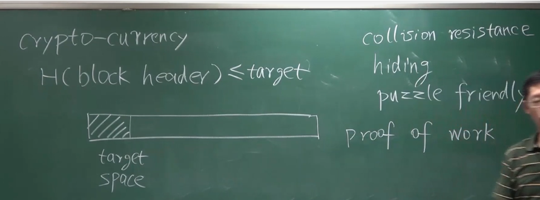

---

**签名**

public key & private key 代表一个账户

公私钥来源于 非对称加密体系 asymmetric encryption algorithm

encryption key - 密钥 传统对称加密

公钥加密 私钥解密 全都使用接收方的 解决对称加密体系 密钥分发的问题

公钥 = 银行账户 私钥 = 密码

在BTC中 用私钥签名 用公钥验证签名

有一个假设：在产生公私钥的时候 有一个好的随机源 a good source of randomness

同时签名的时候也要有好的随机源

BTC中 对massage取哈希 再对哈希签名

## 1.2 BTC-数据结构

**Hash pointers** - 哈希指针 p -> add + H( ) 包含地址与哈希值

普通指针 p -> add

**区块链可以看作链表**

Block chain is a linked list using **hash pointers**

新区块中保存上一个区块的总体哈希值，如果区块发生过篡改，那么哈希值对不上，由此来实施防篡改性。只要保存最新的哈希值，那么可以验证是否篡改。

可以只保存最近的区块，当需要以往的区块的时候，可以问之前的要。要了以后为了防止恶意区块，可以用哈希指针来验证是否篡改过。

---

**Merkle tree 可信树/默克尔树**

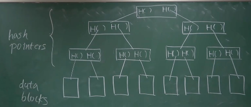

保存 root hash 就可以检测树中任意部分的修改

每个data blocks 是一个交易(tx) 每个区块的内容就是一个**默克尔树**

**block header** 中 包含根哈希值

**block body** 包含所有data

全节点 保存 header & body

轻节点 只保存 header

**Merkle proof** （轻节点 如何验证 一笔交易）

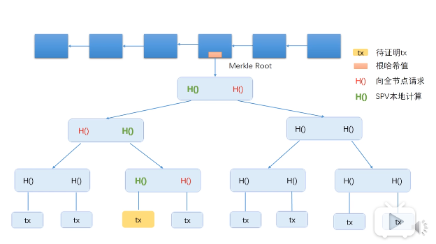

轻节点向全节点请求红色Hash，然后算出绿色的哈希值，验证沿途哈希值都是正确的。

**Merkle proof** 可以证明 **Merkle tree** 包含什么交易 被成为

proof of membership / proof of inclusion

sorted Merkle tree (底层叶节点排序的Merkle tree 可证明某交易不存在)

---

无环的数据结构 都可以用哈希指针

## 1.3 BTC-协议-共识机制

**Double Spending Attack** 双花攻击：是数字货币需要防范的主要攻击

通过维护一个数据结构（区块链）来防范双花攻击 通过溯源防范双花

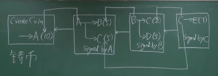

A向B转账 A需要知道B的公钥 全网需要知道A的公钥 因此才能共同记账

A向B转账 中 包含 币的来源的hash指针 上一个区块的hash指针 A的签名 A的公钥 B的公钥哈希值 可以防止双花 也能防止偷钱

------

每个块 = Block header + Block body

Block header = version + hash of previous block header + Merkle root hash + target + nonce

Block body = transaction list

------

**Distributed Consensus** 分布式共识

**Distributed Hash Table**

**FLP impossibility result** 在一个异步系统中，只要有一个成员是faulty，就无法达成共识。

**CAP Theorem** (Consistency Avalibality Partition tolerance) 永远只能满足两个

Paxos 协议 满足一致性

------

BTC中的共识协议 Consensus in BitCoin

**Sybil attack** 女巫攻击 通过不断本地账户来攻击 按人头投票

Membership

- hyperledger fabric 联盟链

BTC中 在打包了一些交易以后，节点要开始试nonce使H(Block header)<=target

当获得了一个合法的nonce后，该节点就获得了记账权。其他节点获得后来验证一下 nBits(难度) & nonce(盐) & body (交易合法，签名合法，币源合法)

------

**Longest Valid Chain** 最长合法链

**Forking Attack** 分块攻击

**Block Reward** 初块奖励

**Coinbase Transaction** 铸币交易

------

比特币的共识机制 是要记录交易 > 通过创造区块/获得记账权来记录交易 < 通过求解从而获得记账权 > 因为Puzzle friendly 所以只能靠算力来计算 被称为hash rate 投票权重

## 1.4 BTC-实现

**Transaction-based ledger** 基于交易的模式(BTC)

UTXO：Unspent Transaction Output

全节点要维护UTXO，以便快速检测，防止双花

total inputs = total outputs

一次交易可能需要多个签名

**Transaction fee** 交易费

**Account-based ledger** 基于账户的模式(ETH)

------

在矿机越来越多的情况下，光调整nonce，有可能无法达到target。

因此可以通过调整 coin base (铸币交易) 中的内容，来调整Merkle Root的Hash，从而来求解target

------

**Bernoulli trial** : a random experiment with binary outcome

**Bernoulli process** : a sequence of independent Bernoulli trials

**Memoryless** 无记忆性

**Poisson process**

**Exponential Distribution** 无记忆性 progress free

挖矿的过程是个 Bernoulli trial 每次挖矿的时间 服从 指数分布

比特币的稀缺性 是人为产生的

挖矿本身是没有意义的 但是挖矿对于维护比特币系统的安全性是至关重要的

**BitCoin is seacured by mining**

------

**防范双花攻击**

等待六个区块-1个小时

**irrevocable ledger**

**selfish mining** 独自挖矿攻击

## 1.5 BTC 网络

The BitCoin Netwrok

- aoolication layer : BitCoin Block chain
- network layer : P2P Overlay Network
- 比特币的网络的节点都是对等的，没有Super node or master node
- 进入时需要seed node

**simple，robust，but not efficient**

**Flooding** 消息在网络上传播的方式

**best effort** 每个节点都尽力

在网络中传播了两个冲突的交易，已经写入的 > 待写中的 > 新收到的

## 1.6 BTC-挖矿难度

H (block header) <= target

SHA-256 - 2^256

difficulty = difficulty_1_target/target

难度最小为1

------

挖矿难度太小 出快速度过快 然而传播速度不足 容易导致分叉

分叉过多对于系统的安全性是威胁

以太坊出块时间 15S

使用ghost 协议

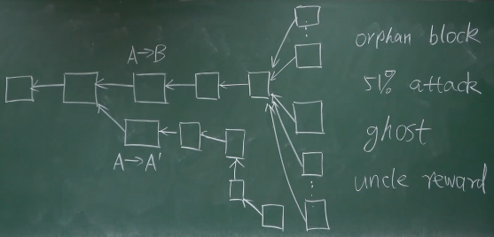

## 1.7 BTC-挖矿

CPU 第一代挖矿

GPU 用于大规模并行计算

ASIC-Application Specific Integrated Cricuit

mining puzzle 挖矿时求解的东西

merge minging 使用已有的mining puzzle

Alternocive mining puzzle > ASIC resistance

------

pool manager - miners

矿池如何分配收益：

nonce & share-almost valid block

挖的target更宽松的区块，可以作为工作量奖励

为了防止矿工私吞，铸币交易的收款地址是矿主的

------

矿池可以发动什么攻击

分叉攻击

Boycott - 封锁账户

不能盗币

on demand computing/mining

## 1.8 BTC-Scripts

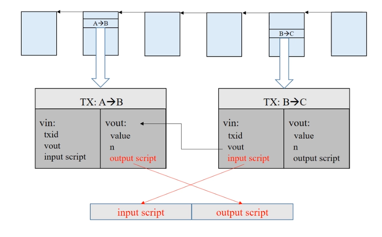

**P2PK(**Pay to Public Key)

**P2PKH**(Pay to Public Key Hash)

**P2SH**(Pay to Script Hash)

- P2SH-多重签名
- 为了避免给转账的消费者增加复杂性，所以使用P2SH来减少操作。

**Proof of Burn**

- AltCoin (Alternative Coin) > 通过销毁比特币来换取某些山寨币
- 往区块链里来写入内容
- 有些交易的输出是0，并没有销毁币子，而是把币子作为交易费发出去了，这样对UTXO友好

## 1.9 BTC-分叉

**Fork**：分叉

state fork：由于对区块链当前的状态产生分歧，导致的分叉

Forking attack - deliberate fork - 分叉攻击

protocd fork：由于对比特币的协议产生了分歧，导致的分叉

Hard fork

Soft fork

---

**Hard fork**：硬分叉

所有节点全部更新才不会永久分叉

block size limit：1M -> 4M

比特币的交易大约 7tx/s，有人想要1M -> 4M，来提高速度，就会产生分叉

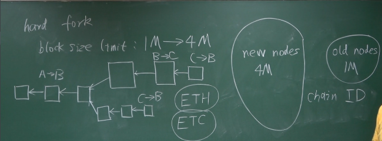

前链上的钱可以双花，分链后似乎变成了两个账户。

---

**Soft fork**：软分叉

半数以上更新就不会永久分叉

block size limit：1M -> 0.5M

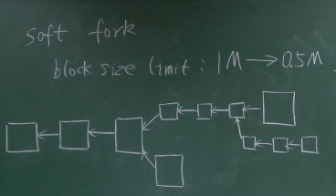

coinbase 域

可以用作extra nonce

有人提议将UTXO的根哈希值写入coinbase域

P2SH：比特币历史上著名的软分叉

P2SH需要两段验证，旧节点只要验证一次，新的要验证两次

## 1.10 BTC-匿名性

Bitcoin and anonymity & privacy

pseudonymity & unnamed

> 多年以前，中国银行是不需要实名的

1.某人可以生成很多地址账户，但是可能是会被分析关联起来的

2.比特币账户与现实世界发生联系时，有可能泄露身份

3.使用比特币支付时，会泄漏身份

**Silk road**

eBay for illegal drugs 基于 TOR

---

hide your identity from whom？

application layer ：coin mixing

network layer ：TOR 多路径转发

区块链的写入时永久的，因此隐私的暴露时灾难性的

---

**零知识证明**

一方证明者，向另一方验证者证明一个陈述是正确的，而无需透露除了陈述是正确的任何信息。

**同态隐藏**

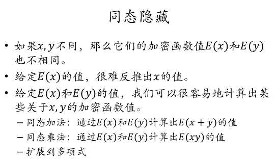

**盲签方法**

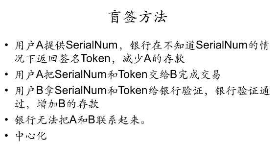

> 盲签的签名是否会泄露信息

**零币和零钞**

非常复杂，不讲了

## 1.11 BTC-问答与思考

**问答**

Mt. Gox 事件

Digital Commitmment : 证明某个时间你已知某个时间

Proof of Burn

验证的时候，只验证当前交易的输入脚本，和上个交易的输入脚本

只有有人想要花这笔钱的时候，才会执行Proof of Burn

不可以偷nonce

铸币交易中有收款地址，改收款地址会导致nonce不可用

---

**思考**

哈希指针

**指针只在本地有意义**

哈希指针在传播时，只有哈希，没有指针

(key,value)  数据库 level DB

哈希指针保证了整个区块链的内容是不可篡改的

区块恋

情侣在买了币子以后，私钥掰开，一人一份。

请使用多重签名

UTXO unfriendly

分布式共识

理论上的问题，与实际总是有差异。

异步：通讯的延迟，是没有上限的。

对知识的一知半解，有可能会致使你变得更差。

比特币的稀缺性

稀缺的东西是不适合做货币的

好的货币应该有通胀的

量子计算

与其担心比特币

不如担心传统金融

比特币私钥可以推出公钥

比特币的地址是公钥的哈希

加密过程要保证信息的完整性，而哈希函数不需要保存，甚至在丢失信息。

从安全上，比特币的地址最好只用一次。

# ETH

## 2.1 ETH-概述

ETH mining puzzle ：memory hard ASIC resistance 对抗挖矿机器ASIC化

BTC mining puzzle 计算密集型

用权益证明替代工作量证明

proof of work -> proof of stake

smart contranct 智能合约

BitCoin：decentralized currency

ETH：decentralized contract

智能合约，用区块链的不可篡改性，来实行合约/合同

---

fiat currency VS decentralized currency

使用司法手段来进行合同低效，用技术来解决解决会好一些。

## 2.2 ETH-账户

BTC - based tx

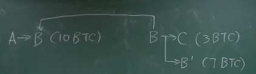

ETH - based ledger

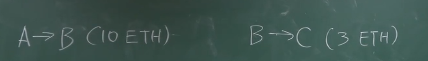

---

ETH可以天然防御双花攻击

**replay attack** 重放攻击

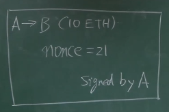

对于 付款账户的有史以来交易次数 进行签名

---

外部账户 - externally owned account

合约账户 - smart contract accont

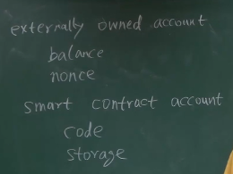